# Userflow Design: elysiae-tui

## Application State Machine

Single screen with modal overlays. All input feeds one decision tree.

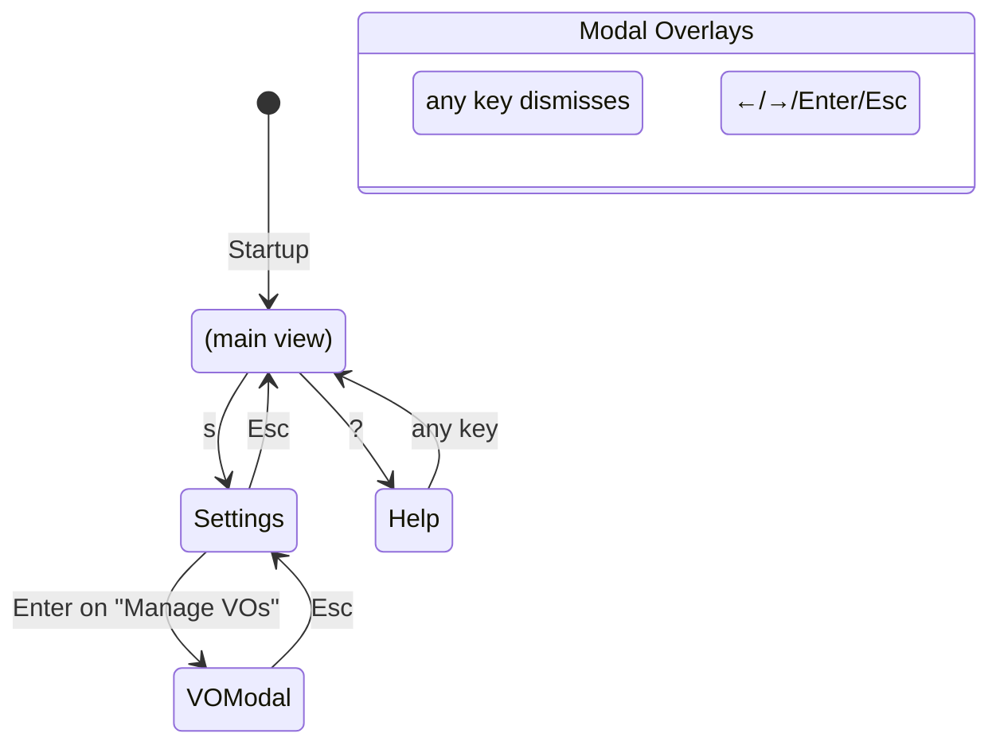

## Per-Game State Derivation

Each game resolves to one state. Checked top-to-bottom, first match wins:

```
fn game_state(app, game) -> GameState:
    if app.download.is_some() AND dl.game_id == game:
        return Downloading (or Updating/Preinstalling based on op type)
    
    let gs = app.games[game]
    
    if gs.has_resume:
        return Resumable
    
    if gs.installed_tag.is_some():
        if gs.update_info.update_available:
            return UpdateAvailable
        else:
            return Installed
    
    return NotInstalled
```

### State → UI Mapping

| Game State | Button Label | Enter Action | Available Keys |
|-----------|-------------|-------------|----------------|
| NotInstalled | `Get Game` | `start_download()` | — |
| Resumable | `Resume` | `start_resume()` | — |
| Installed | `Launch` | `prepare_and_launch()` | `v` verify |
| UpdateAvailable | `Update` | `start_update()` | `p` preinstall, `a` apply |
| Downloading | `Downloading...` | no-op | `p` pause/resume, `c` cancel |
| Updating | `Updating...` | no-op | `p` pause/resume, `c` cancel |

## Startup Sequence

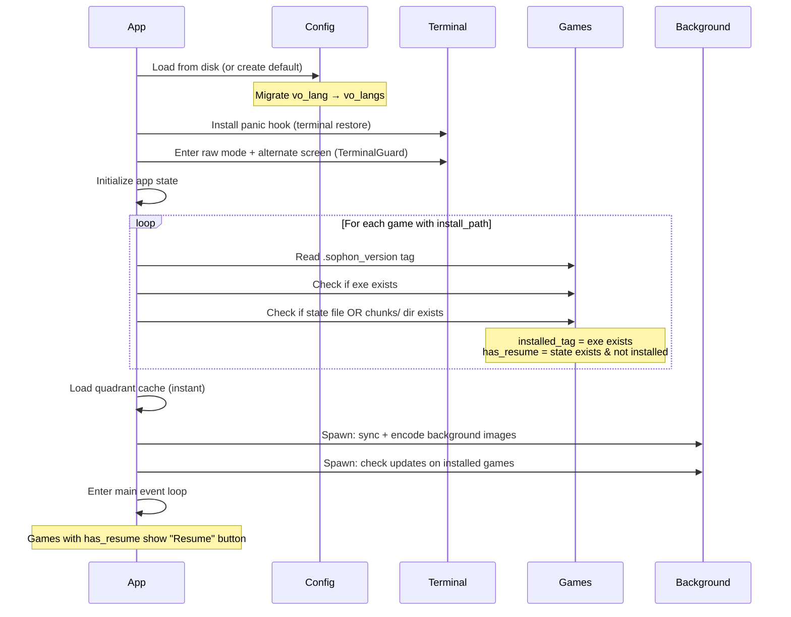

## Main Event Loop (per tick, 33ms)

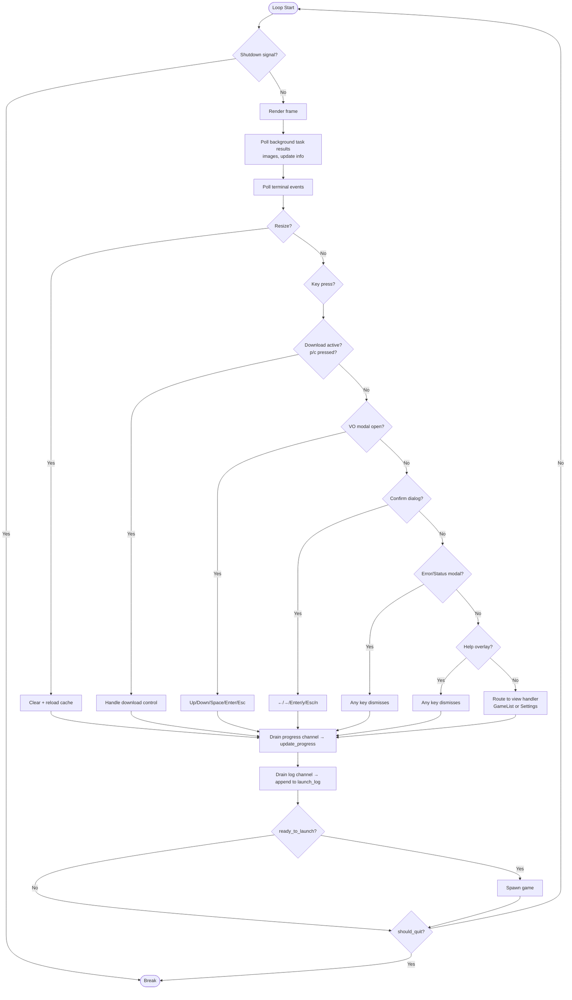

## Key Dispatch (Game List View)

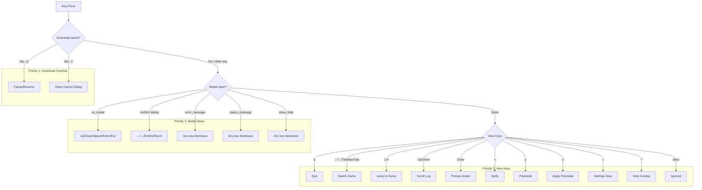

## Key Dispatch (Settings View)

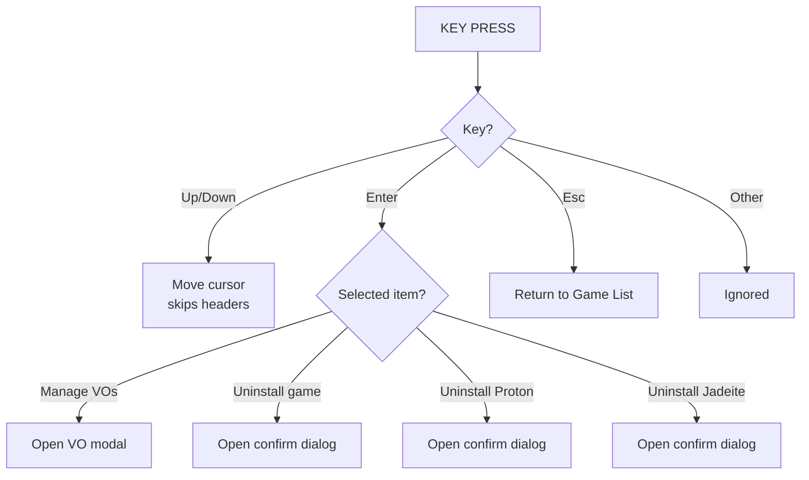

## Confirm Dialog

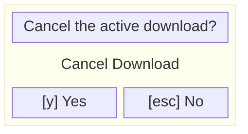

Controls:
- `←/→` move selection between Yes and No
- `Enter` activate selected button
- `y` immediately confirm (shortcut)
- `Esc/n` immediately dismiss

Default selection: No (prevents accidental destructive action)

## VO Manager Modal

```mermaid
block-beta
  columns 1
  block:modal["Manage Voice-Overs"]
    columns 1
    en["[x] English (en-us)"]
    ja["[x] Japanese (ja-jp)"]
    zhcn["[ ] Chinese Simplified (zh-cn)"]
    zhtw["[ ] Chinese Traditional (zh-tw)"]
    ko["[ ] Korean (ko-kr)"]
    space[" "]
    footer["[space] toggle  [enter] apply  [esc]"]
  end
```

Rules:
- At least one language must remain enabled
- Toggling the last enabled language is a no-op
- On apply: config saves immediately, new langs trigger download

## Settings View Layout

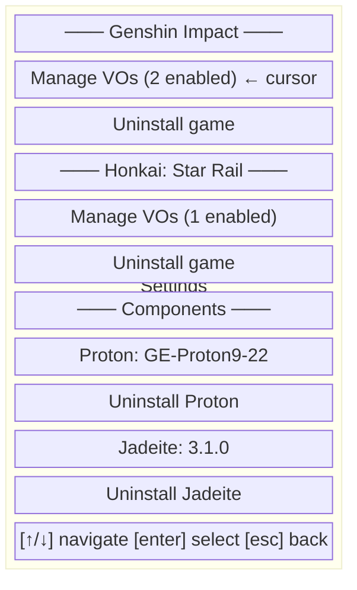

Only installed games appear. Cursor skips non-selectable rows (headers, component info). Uninstall items render red.

## Download Lifecycle

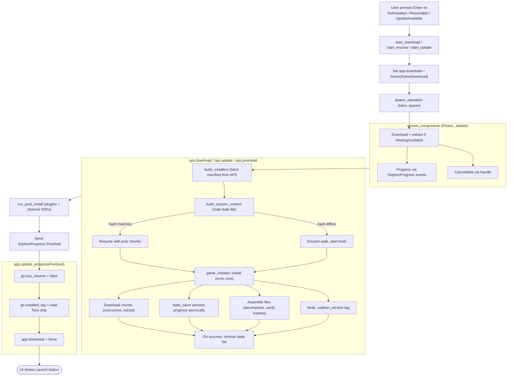

## Cancel Flow

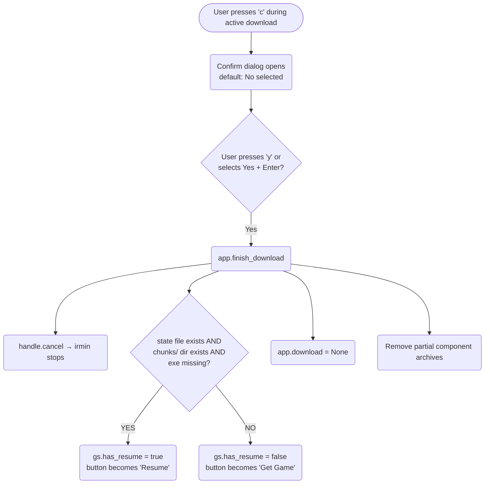

## Resume Flow

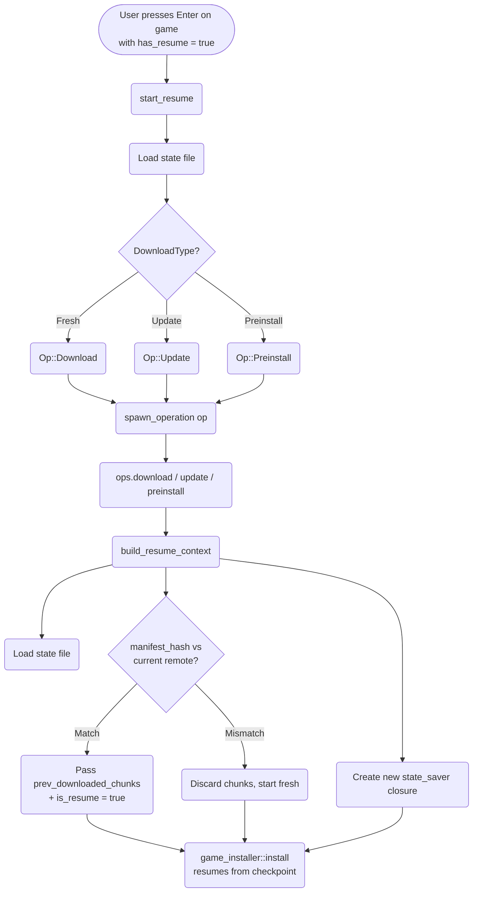

## Launch Flow

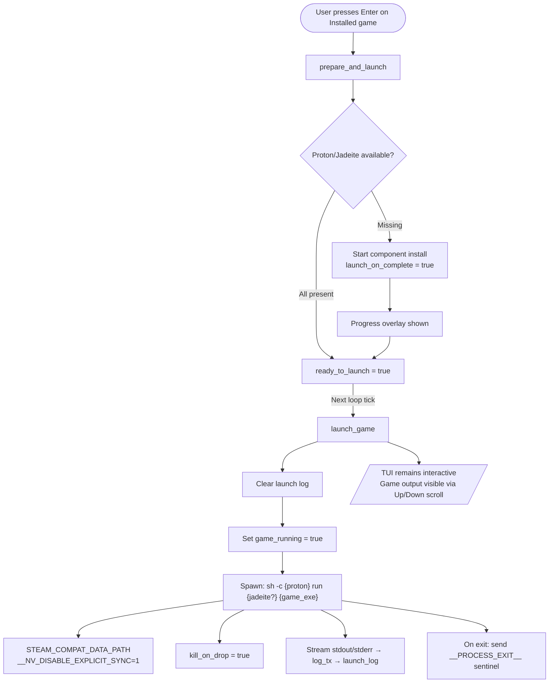

## Uninstall Flow (from Settings)

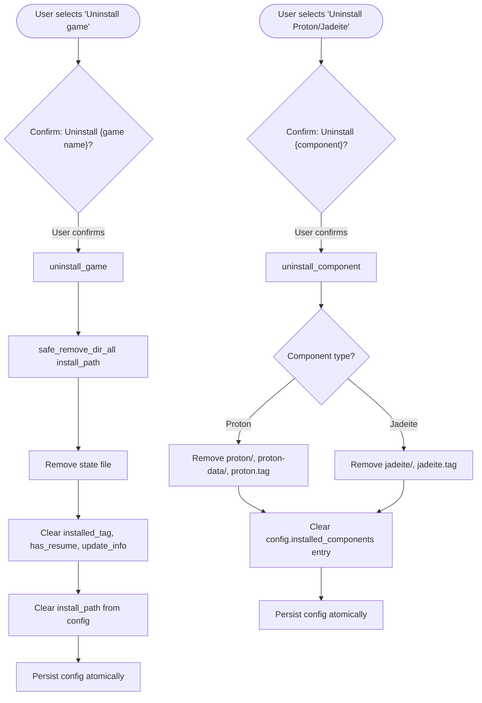

## Signal Handling

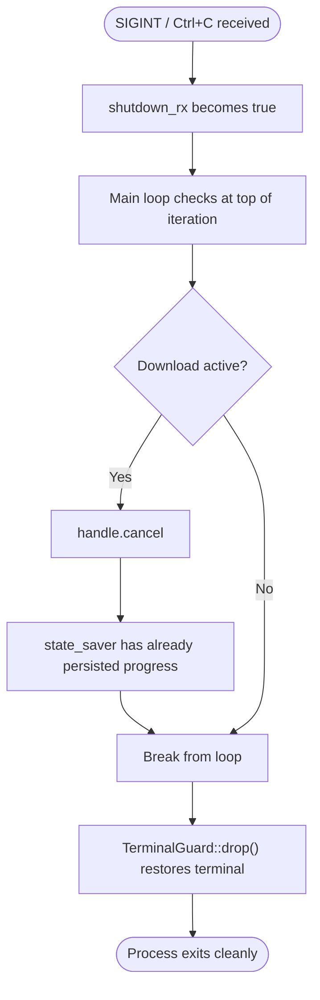

## Error Recovery

| Scenario | What happens |
|----------|-------------|
| Network timeout during download | irmin retries 5x internally; if all fail, Error event sent, state file preserved |
| Panic in any code | Panic hook restores terminal, prints panic info |
| `?` return inside TUI function | TerminalGuard Drop restores terminal |
| Disk full during download | Write fails, Error event sent, state file has progress up to last successful chunk |
| Corrupt config.json | Preserved as `.corrupted-{ts}`, fresh default created |
| Game process crashes | Exit code shown in log, `game_running` cleared on `__PROCESS_EXIT__` |
| Uninstall fails (permissions) | Error modal shown with OS error message |
| VO download fails | Error modal shown, previously-enabled languages remain |

## Visual Layout (Game List)

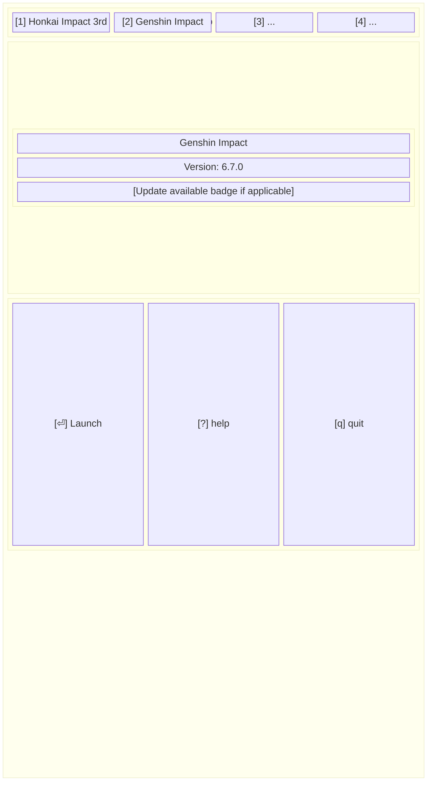

## Data Flow Diagram

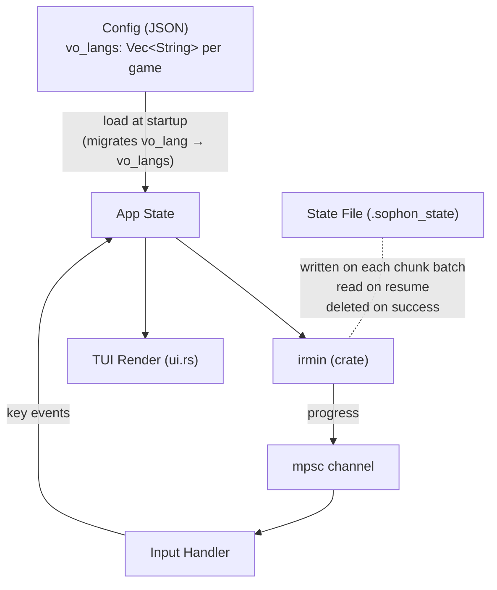

## Config Schema

```json
{
  "version": 1,
  "selected_game": "hk4e",
  "auto_update": true,
  "auto_preload": true,
  "games": {
    "hk4e": {
      "vo_langs": ["en-us", "ja-jp"],
      "install_path": "/home/user/.local/share/elysiae-tui/games/hk4e"
    },
    "hkrpg": {
      "vo_langs": ["en-us"],
      "install_path": "/home/user/.local/share/elysiae-tui/games/hkrpg"
    }
  },
  "installed_components": {
    "proton": "GE-Proton9-22",
    "jadeite": "3.1.0"
  }
}
```

Backward compatible: old configs with `"vo_lang": "en-us"` auto-migrate to `"vo_langs": ["en-us"]` on load.

## Session Lifecycle

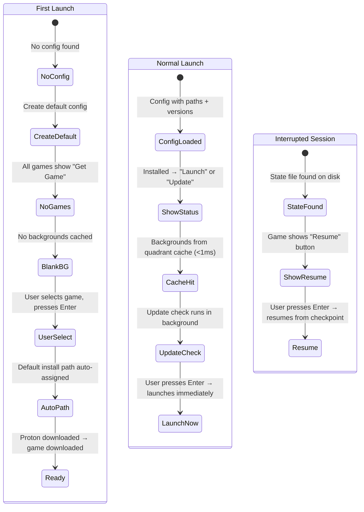
