# User Interaction Flows

Conventions:
- `([text])` = terminal (start/end)
- `[text]` = action
- `{text}` = decision
- `|label|` = edge annotation

---

## 1. Navigation

Two views: GameList (default) and Settings (overlay). Modals stack on top of either.

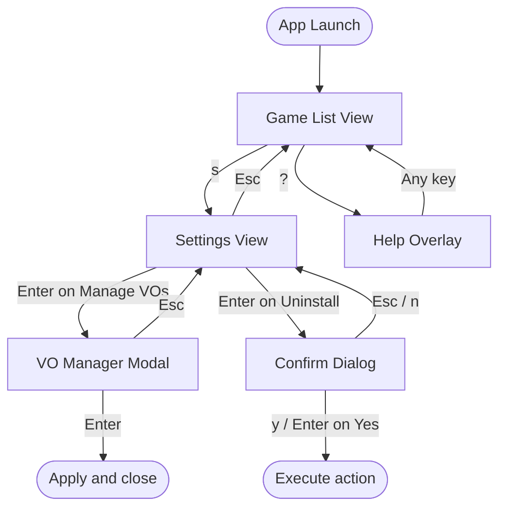
```mermaid
flowchart TD
    Start([App Launch]) --> GameList[Game List View]
    GameList -->|s| Settings[Settings View]
    GameList -->|?| Help[Help Overlay]
    Settings -->|Esc| GameList
    Settings -->|Enter on Manage VOs| VOModal[VO Manager Modal]
    Settings -->|Enter on Uninstall| Confirm[Confirm Dialog]
    VOModal -->|Esc| Settings
    VOModal -->|Enter| ApplyVO([Apply and close])
    Confirm -->|y / Enter on Yes| Execute([Execute action])
    Confirm -->|Esc / n| Settings
    Help -->|Any key| GameList
```

---

## 2. Game State Derivation

Each game resolves to one state. First match wins.

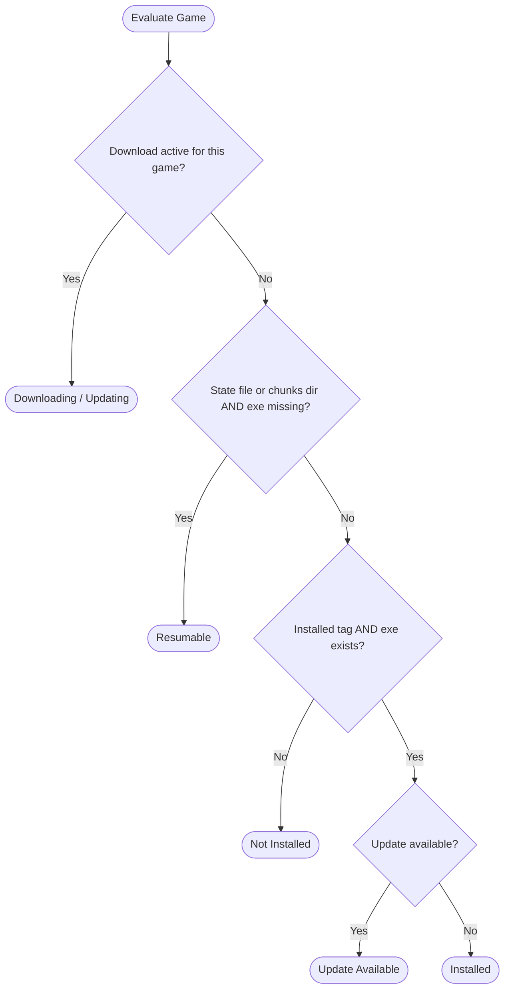
```mermaid
flowchart TD
    Start([Evaluate Game]) --> DLActive{Download active for this game?}
    DLActive -->|Yes| Downloading([Downloading / Updating])
    DLActive -->|No| HasResume{State file or chunks dir AND exe missing?}
    HasResume -->|Yes| Resumable([Resumable])
    HasResume -->|No| HasTag{Installed tag AND exe exists?}
    HasTag -->|No| NotInstalled([Not Installed])
    HasTag -->|Yes| HasUpdate{Update available?}
    HasUpdate -->|Yes| UpdateAvailable([Update Available])
    HasUpdate -->|No| Installed([Installed])
```

### State Actions

| State | Button | Enter Action | Extra Keys |
|-------|--------|--------------|------------|
| Not Installed | Get Game | Start download | — |
| Resumable | Resume | Resume download | — |
| Installed | Launch | Prepare and launch | `v` verify |
| Update Available | Update | Start update | `r` preinstall, `a` apply |
| Downloading / Updating | Downloading... | No-op | `p` pause/resume, `c` cancel |

---

## 3. Startup

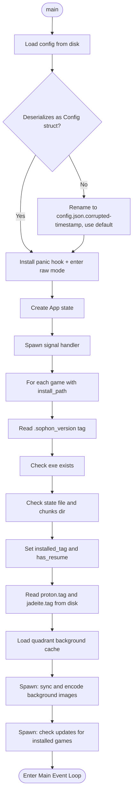
```mermaid
flowchart TD
    Start([main]) --> LoadConfig[Load config from disk]
    LoadConfig --> Corrupt{Deserializes as Config struct?}
    Corrupt -->|No| Preserve[Rename to config.json.corrupted-timestamp, use default]
    Corrupt -->|Yes| InitTerm
    Preserve --> InitTerm[Install panic hook + enter raw mode]
    InitTerm -->     InitApp[Create App state]
    InitApp --> SpawnSignal[Spawn signal handler]
    SpawnSignal --> ScanGames[For each game with install_path]
    ScanGames --> ReadTag[Read .sophon_version tag]
    ReadTag --> CheckExe[Check exe exists]
    CheckExe --> CheckState[Check state file and chunks dir]
    CheckState --> DeriveState[Set installed_tag and has_resume]
    DeriveState --> SyncComponents[Read proton.tag and jadeite.tag from disk]
    SyncComponents --> LoadCache[Load quadrant background cache]
    LoadCache --> SpawnBG[Spawn: sync and encode background images]
    SpawnBG --> SpawnUpdate[Spawn: check updates for installed games]
    SpawnUpdate --> EnterLoop([Enter Main Event Loop])
```

---

## 4. Main Event Loop

Runs every 33ms.

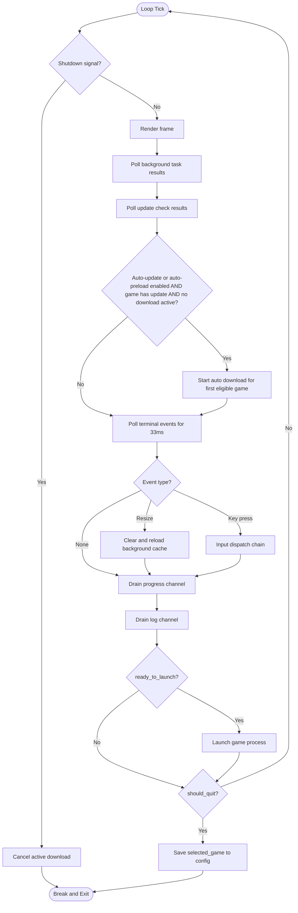
```mermaid
flowchart TD
    Tick([Loop Tick]) --> Shutdown{Shutdown signal?}
    Shutdown -->|Yes| CancelDL[Cancel active download]
    CancelDL --> Break([Break and Exit])
    Shutdown -->|No| Render[Render frame]
    Render --> PollBG[Poll background task results]
    PollBG --> PollUpdate[Poll update check results]
    PollUpdate --> AutoCheck{Auto-update or auto-preload enabled AND game has update AND no download active?}
    AutoCheck -->|Yes| StartAuto[Start auto download for first eligible game]
    AutoCheck -->|No| PollInput
    StartAuto --> PollInput[Poll terminal events for 33ms]
    PollInput --> HasEvent{Event type?}
    HasEvent -->|None| Drain
    HasEvent -->|Resize| ReloadCache[Clear and reload background cache]
    HasEvent -->|Key press| Dispatch[Input dispatch chain]
    ReloadCache --> Drain
    Dispatch --> Drain[Drain progress channel]
    Drain --> DrainLog[Drain log channel]
    DrainLog --> LaunchReady{ready_to_launch?}
    LaunchReady -->|Yes| SpawnGame[Launch game process]
    LaunchReady -->|No| Quit{should_quit?}
    SpawnGame --> Quit
    Quit -->|Yes| SaveConfig[Save selected_game to config]
    SaveConfig --> Break
    Quit -->|No| Tick
```

---

## 5. Input Dispatch

First matching handler consumes the key.

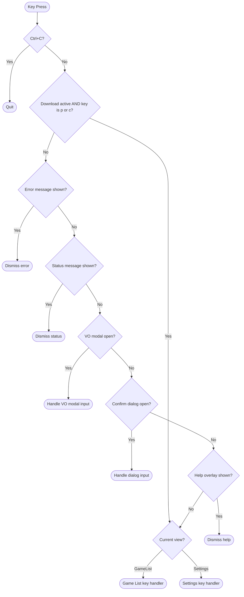
```mermaid
flowchart TD
    Key([Key Press]) --> CtrlC{Ctrl+C?}
    CtrlC -->|Yes| Quit([Quit])
    CtrlC -->|No| DLBypass{Download active AND key is p or c?}
    DLBypass -->|Yes| RouteView
    DLBypass -->|No| ErrModal{Error message shown?}
    ErrModal -->|Yes| DismissErr([Dismiss error])
    ErrModal -->|No| StatusModal{Status message shown?}
    StatusModal -->|Yes| DismissStatus([Dismiss status])
    StatusModal -->|No| VOOpen{VO modal open?}
    VOOpen -->|Yes| HandleVO([Handle VO modal input])
    VOOpen -->|No| DialogOpen{Confirm dialog open?}
    DialogOpen -->|Yes| HandleDialog([Handle dialog input])
    DialogOpen -->|No| HelpOpen{Help overlay shown?}
    HelpOpen -->|Yes| DismissHelp([Dismiss help])
    HelpOpen -->|No| RouteView{Current view?}
    RouteView -->|GameList| GameListHandler([Game List key handler])
    RouteView -->|Settings| SettingsHandler([Settings key handler])
```

The `p`/`c` bypass skips modals but routes through the view handler. GameList handles `p`/`c` (Section 6); Settings ignores them.

---

## 6. Game List Keys

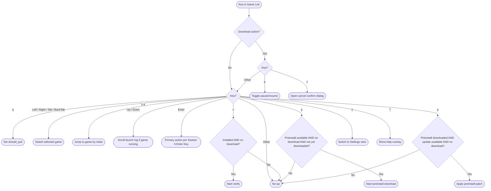
```mermaid
flowchart TD
    Key([Key in Game List]) --> IsDL{Download active?}
    IsDL -->|Yes| DLKey{Key?}
    IsDL -->|No| Which
    DLKey -->|p| TogglePause([Toggle pause/resume])
    DLKey -->|c| OpenCancel([Open cancel confirm dialog])
    DLKey -->|Other| Which{Key?}
    Which -->|q| Quit([Set should_quit])
    Which -->|Left / Right / Tab / BackTab| SwitchGame([Switch selected game])
    Which -->|1-4| JumpGame([Jump to game by index])
    Which -->|Up / Down| ScrollLog([Scroll launch log if game running])
    Which -->|Enter| PrimaryAction([Primary action per Section 6 Enter Key])
    Which -->|v| Verify{Installed AND no download?}
    Which -->|p| PreinstallCheck{Preinstall available AND no download AND not yet downloaded?}
    Which -->|a| ApplyCheck{Preinstall downloaded AND update available AND no download?}
    Which -->|s| OpenSettings([Switch to Settings view])
    Which -->|?| ShowHelp([Show help overlay])
    Which -->|Other| Ignore([No-op])
    Verify -->|Yes| StartVerify([Start verify])
    Verify -->|No| Ignore
    PreinstallCheck -->|Yes| StartPreinstall([Start preinstall download])
    PreinstallCheck -->|No| Ignore
    ApplyCheck -->|Yes| ApplyPreinstall([Apply preinstall patch])
    ApplyCheck -->|No| Ignore
```

### Enter Key (Primary Action)

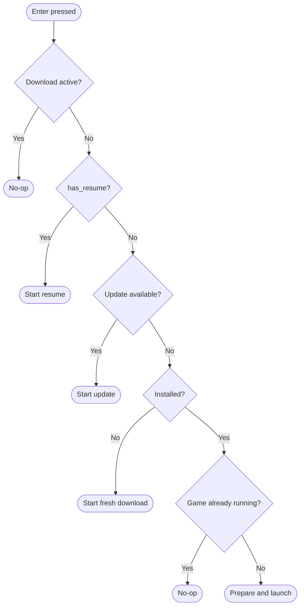
```mermaid
flowchart TD
    Enter([Enter pressed]) --> DLActive{Download active?}
    DLActive -->|Yes| Noop([No-op])
    DLActive -->|No| HasResume{has_resume?}
    HasResume -->|Yes| Resume([Start resume])
    HasResume -->|No| HasUpdate{Update available?}
    HasUpdate -->|Yes| Update([Start update])
    HasUpdate -->|No| IsInstalled{Installed?}
    IsInstalled -->|No| Download([Start fresh download])
    IsInstalled -->|Yes| GameRunning{Game already running?}
    GameRunning -->|Yes| NoopRunning([No-op])
    GameRunning -->|No| Launch([Prepare and launch])
```

---

## 7. Settings Keys

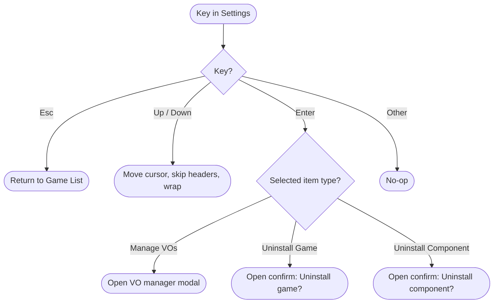
```mermaid
flowchart TD
    Key([Key in Settings]) --> Which{Key?}
    Which -->|Esc| Return([Return to Game List])
    Which -->|Up / Down| MoveCursor([Move cursor, skip headers, wrap])
    Which -->|Enter| Activate{Selected item type?}
    Which -->|Other| Ignore([No-op])
    Activate -->|Manage VOs| OpenVO([Open VO manager modal])
    Activate -->|Uninstall Game| ConfirmGame([Open confirm: Uninstall game?])
    Activate -->|Uninstall Component| ConfirmComp([Open confirm: Uninstall component?])
```

Installed games appear. The download-active guard for uninstall runs in the action handler (Section 16), not here.

---

## 8. Confirm Dialog

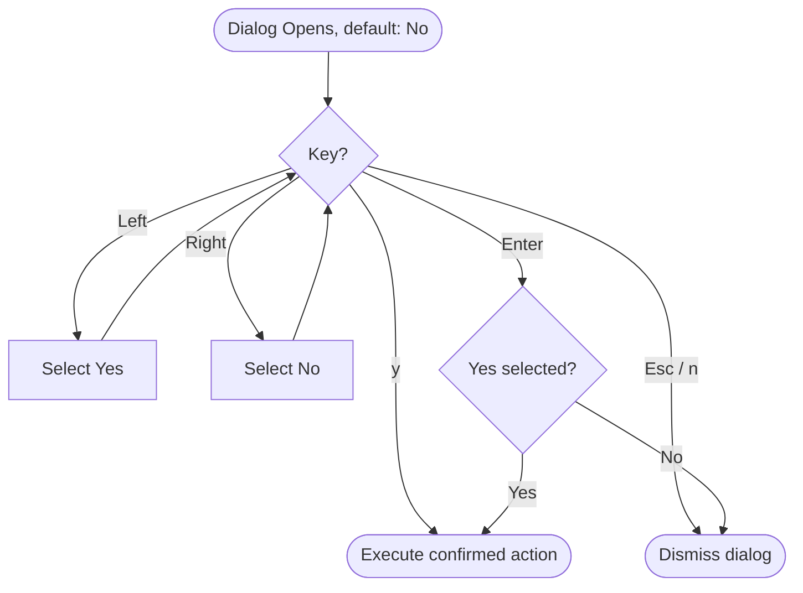
```mermaid
flowchart TD
    Open([Dialog Opens, default: No]) --> Key{Key?}
    Key -->|Left| SelectYes[Select Yes]
    Key -->|Right| SelectNo[Select No]
    Key -->|y| ExecuteAction([Execute confirmed action])
    Key -->|Enter| CheckSel{Yes selected?}
    Key -->|Esc / n| Dismiss([Dismiss dialog])
    CheckSel -->|Yes| ExecuteAction
    CheckSel -->|No| Dismiss
    SelectYes --> Key
    SelectNo --> Key
```

Dialog actions by kind:
- Cancel Download: calls `finish_download()`
- Uninstall Game: removes game directory and clears state
- Uninstall Component: removes component directory and clears config

---

## 9. VO Manager Modal

Languages: en-us, ja-jp, zh-cn, zh-tw, ko-kr. At least one must stay enabled.

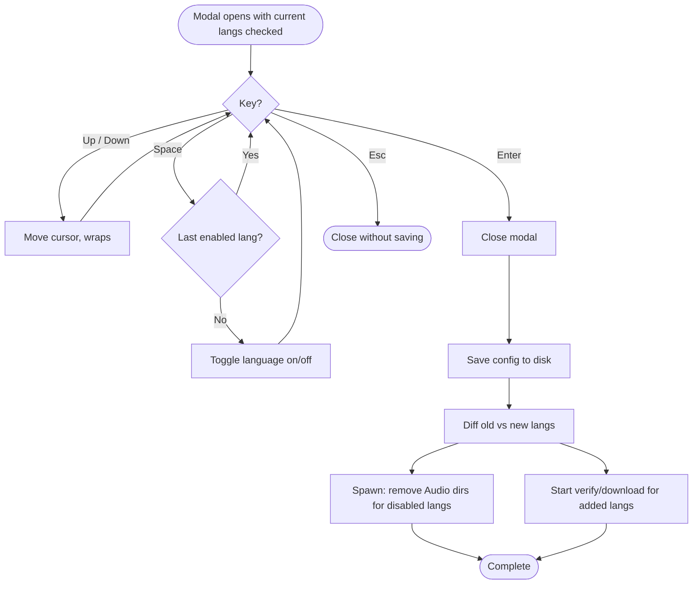
```mermaid
flowchart TD
    Open([Modal opens with current langs checked]) --> Key{Key?}
    Key -->|Up / Down| MoveCursor[Move cursor, wraps]
    Key -->|Space| LastLang{Last enabled lang?}
    LastLang -->|Yes| Key
    LastLang -->|No| ToggleLang[Toggle language on/off]
    Key -->|Enter| CloseModal[Close modal]
    Key -->|Esc| Cancel([Close without saving])
    ToggleLang --> Key
    MoveCursor --> Key
    CloseModal --> SaveConfig[Save config to disk]
    SaveConfig --> ComputeDiff[Diff old vs new langs]
    ComputeDiff --> SpawnRemove[Spawn: remove Audio dirs for disabled langs]
    ComputeDiff --> StartDownload[Start verify/download for added langs]
    SpawnRemove --> Done([Complete])
    StartDownload --> Done
```

The modal closes before file operations begin. Removal and addition run as independent spawned tasks. The download task checks for cancellation between languages and before sending Finished. If download of added langs fails, the config retains the new selection (optimistic commit).

---

## 10. Download Lifecycle

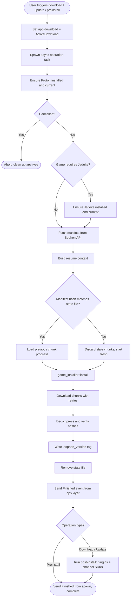
```mermaid
flowchart TD
    Trigger([User triggers download / update / preinstall]) --> SetActive[Set app.download = ActiveDownload]
    SetActive --> Spawn[Spawn async operation task]
    Spawn --> EnsureProton[Ensure Proton installed and current]
    EnsureProton --> CancelCheck{Cancelled?}
    CancelCheck -->|Yes| Abort([Abort, clean up archives])
    CancelCheck -->|No| NeedsJadeite{Game requires Jadeite?}
    NeedsJadeite -->|Yes| EnsureJadeite[Ensure Jadeite installed and current]
    NeedsJadeite -->|No| FetchManifest
    EnsureJadeite --> FetchManifest[Fetch manifest from Sophon API]
    FetchManifest --> BuildResume[Build resume context]
    BuildResume --> HashMatch{Manifest hash matches state file?}
    HashMatch -->|Yes| ResumeChunks[Load previous chunk progress]
    HashMatch -->|No| FreshStart[Discard stale chunks, start fresh]
    ResumeChunks --> Install[game_installer::install]
    FreshStart --> Install
    Install --> DownloadChunks[Download chunks with retries]
    DownloadChunks --> AssembleFiles[Decompress and verify hashes]
    AssembleFiles --> WriteTag[Write .sophon_version tag]
    WriteTag --> RemoveState[Remove state file]
    RemoveState --> SendFinishedOps[Send Finished event from ops layer]
    SendFinishedOps --> IsPreinstall{Operation type?}
    IsPreinstall -->|Preinstall| SendFinishedSpawn([Send Finished from spawn, complete])
    IsPreinstall -->|Download / Update| PostInstall[Run post-install: plugins + channel SDKs]
    PostInstall --> SendFinishedSpawn
```

A new download cancels any in-progress download before starting. State saver writes progress after each chunk batch (logs one warning per failure streak, resets on recovery). On non-cancel error: the spawn layer sends Error then Finished. On cancellation: the spawn layer sends nothing (the cancel UI flow already cleared `app.download`). The state file stays on disk for resume.

Honkai: Star Rail is the one game requiring Jadeite. The cancellation check runs between Proton and Jadeite even if the game doesn't need Jadeite.

---

## 11. Component Installation

The availability check and version comparison happen at the call site (Section 10); below is the install operation only.

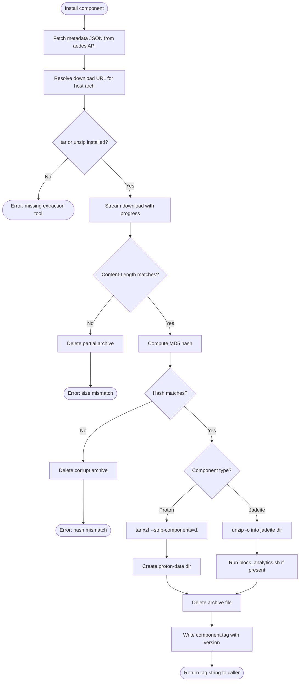
```mermaid
flowchart TD
    Start([Install component]) --> FetchMeta[Fetch metadata JSON from aedes API]
    FetchMeta --> ResolveArch[Resolve download URL for host arch]
    ResolveArch --> Preflight{tar or unzip installed?}
    Preflight -->|No| Fail([Error: missing extraction tool])
    Preflight -->|Yes| Download[Stream download with progress]
    Download --> VerifySize{Content-Length matches?}
    VerifySize -->|No| DeletePartial[Delete partial archive]
    VerifySize -->|Yes| VerifyHash[Compute MD5 hash]
    DeletePartial --> FailSize([Error: size mismatch])
    VerifyHash --> HashOK{Hash matches?}
    HashOK -->|No| DeleteCorrupt[Delete corrupt archive]
    HashOK -->|Yes| Extract{Component type?}
    DeleteCorrupt --> FailHash([Error: hash mismatch])
    Extract -->|Proton| TarExtract[tar xzf --strip-components=1]
    Extract -->|Jadeite| UnzipExtract[unzip -o into jadeite dir]
    TarExtract --> PostProton[Create proton-data dir]
    UnzipExtract --> PostJadeite[Run block_analytics.sh if present]
    PostProton --> CleanArchive[Delete archive file]
    PostJadeite --> CleanArchive
    CleanArchive --> WriteTag[Write component.tag with version]
    WriteTag --> SendFinished([Return tag string to caller])
```

The caller's Finished event handler syncs `config.installed_components` from the `.tag` files on disk. Cancellation uses `tokio::select!` with the cancel future to abort mid-download and remove the partial archive.

---

## 12. Cancel Flow

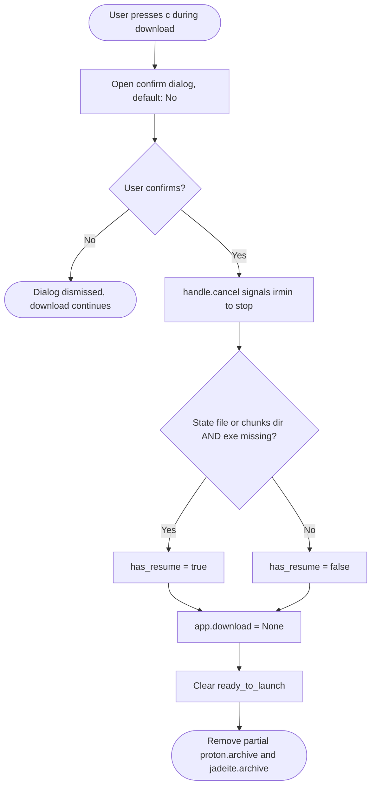
```mermaid
flowchart TD
    Press([User presses c during download]) --> Dialog[Open confirm dialog, default: No]
    Dialog --> Confirmed{User confirms?}
    Confirmed -->|No| Dismiss([Dialog dismissed, download continues])
    Confirmed -->|Yes| CancelHandle[handle.cancel signals irmin to stop]
    CancelHandle --> CheckResume{State file or chunks dir AND exe missing?}
    CheckResume -->|Yes| SetResume[has_resume = true]
    CheckResume -->|No| SetNoResume[has_resume = false]
    SetResume --> ClearDL[app.download = None]
    SetNoResume --> ClearDL
    ClearDL --> ClearReady[Clear ready_to_launch]
    ClearReady --> CleanArchives([Remove partial proton.archive and jadeite.archive])
```

Cancelling an update leaves the prior installation intact. State re-derives as Update Available per Section 2 (exe present, update pending). The cancelled spawned task sends no Finished event; the cancel UI flow already cleared `app.download`.

---

## 13. Resume Flow

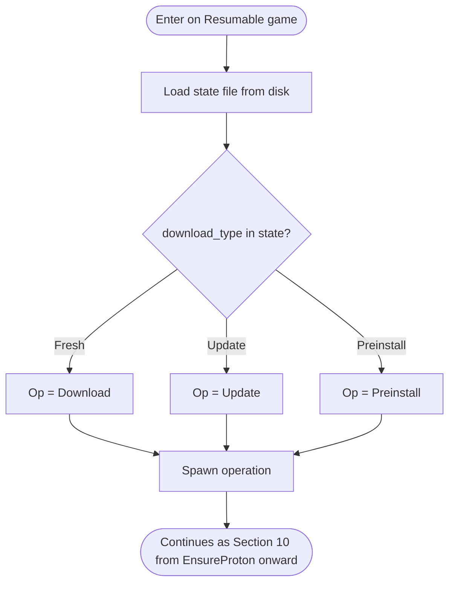
```mermaid
flowchart TD
    Press([Enter on Resumable game]) --> LoadState[Load state file from disk]
    LoadState --> DetermineOp{download_type in state?}
    DetermineOp -->|Fresh| OpDownload[Op = Download]
    DetermineOp -->|Update| OpUpdate[Op = Update]
    DetermineOp -->|Preinstall| OpPreinstall[Op = Preinstall]
    OpDownload --> SpawnOp[Spawn operation]
    OpUpdate --> SpawnOp
    OpPreinstall --> SpawnOp
    SpawnOp --> Continue([Continues as Section 10 from EnsureProton onward])
```

Section 10's `BuildResume` step compares the manifest hash to decide whether to reuse prior chunks or discard them.

---

## 14. Launch Flow

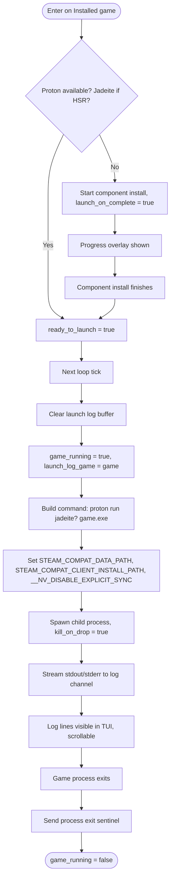
```mermaid
flowchart TD
    Press([Enter on Installed game]) --> CheckComp{Proton available? Jadeite if HSR?}
    CheckComp -->|Yes| SetReady[ready_to_launch = true]
    CheckComp -->|No| InstallComp[Start component install, launch_on_complete = true]
    InstallComp --> Progress[Progress overlay shown]
    Progress --> CompDone[Component install finishes]
    CompDone --> SetReady
    SetReady --> NextTick[Next loop tick]
    NextTick --> ClearLog[Clear launch log buffer]
    ClearLog --> SetRunning[game_running = true, launch_log_game = game]
    SetRunning --> BuildCmd[Build command: proton run jadeite? game.exe]
    BuildCmd --> SetEnv[Set STEAM_COMPAT_DATA_PATH, STEAM_COMPAT_CLIENT_INSTALL_PATH, __NV_DISABLE_EXPLICIT_SYNC]
    SetEnv --> SpawnProc[Spawn child process, kill_on_drop = true]
    SpawnProc --> PipeOutput[Stream stdout/stderr to log channel]
    PipeOutput --> StreamLog[Log lines visible in TUI, scrollable]
    StreamLog --> Exit[Game process exits]
    Exit --> Sentinel[Send process exit sentinel]
    Sentinel --> ClearRunning([game_running = false])
```

The TUI stays interactive during gameplay. Honkai: Star Rail is the one game using Jadeite.

---

## 15. Verify Flow

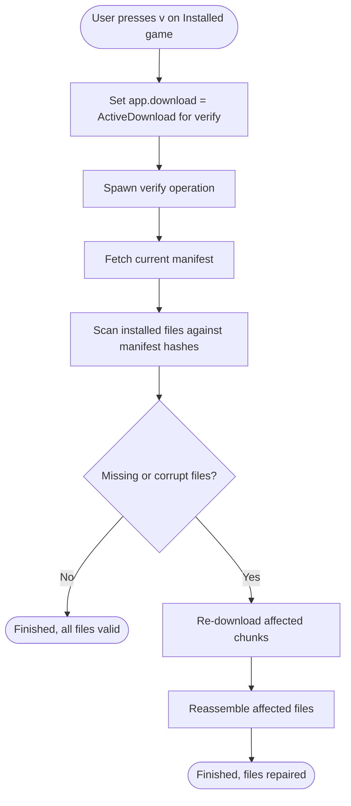
```mermaid
flowchart TD
    Press([User presses v on Installed game]) --> SetActive[Set app.download = ActiveDownload for verify]
    SetActive --> Spawn[Spawn verify operation]
    Spawn --> FetchManifest[Fetch current manifest]
    FetchManifest --> ScanFiles[Scan installed files against manifest hashes]
    ScanFiles --> Mismatch{Missing or corrupt files?}
    Mismatch -->|No| Finished([Finished, all files valid])
    Mismatch -->|Yes| RedownloadChunks[Re-download affected chunks]
    RedownloadChunks --> Reassemble[Reassemble affected files]
    Reassemble --> FinishedRepaired([Finished, files repaired])
```

Reports progress via `CheckingFiles` and `Downloading` events.

---

## 16. Uninstall Flow

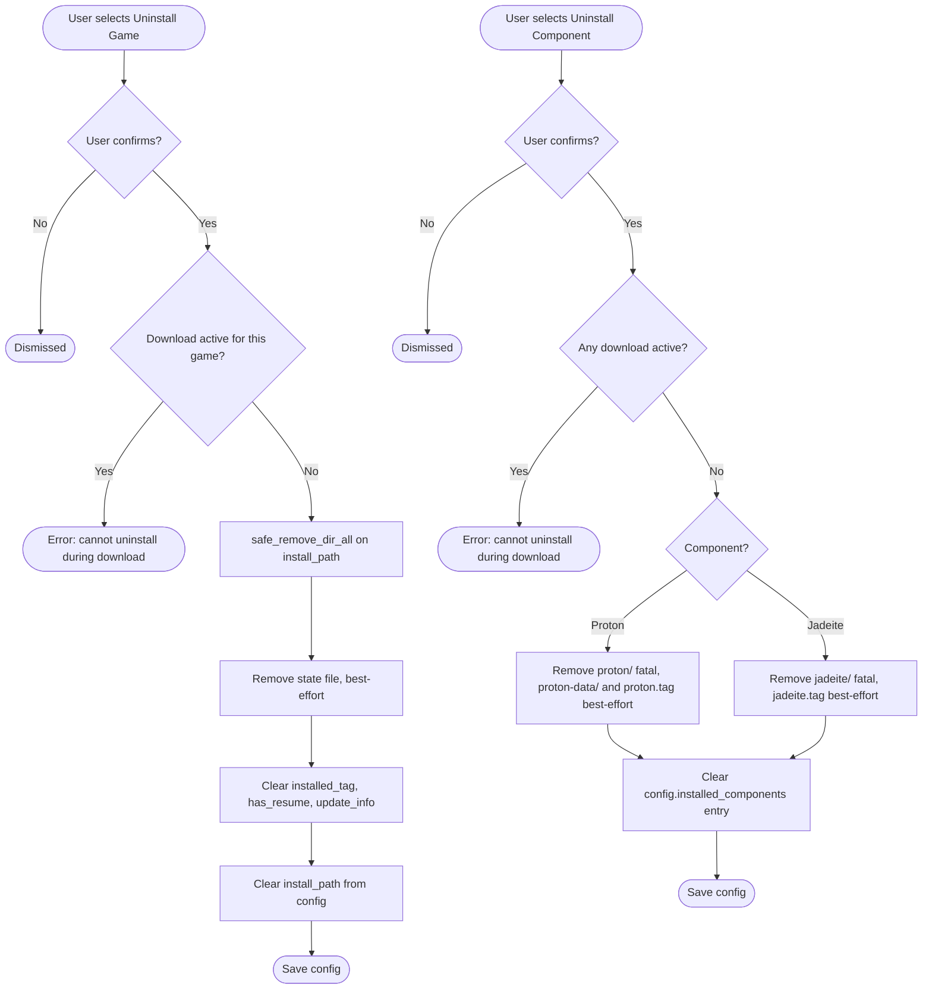
```mermaid
flowchart TD
    SelectGame([User selects Uninstall Game]) --> ConfirmG{User confirms?}
    ConfirmG -->|No| CancelGame([Dismissed])
    ConfirmG -->|Yes| GuardGame{Download active for this game?}
    GuardGame -->|Yes| Error([Error: cannot uninstall during download])
    GuardGame -->|No| RemoveDir[safe_remove_dir_all on install_path]
    RemoveDir --> RemoveState[Remove state file, best-effort]
    RemoveState --> ClearStatus[Clear installed_tag, has_resume, update_info]
    ClearStatus --> ClearConfig[Clear install_path from config]
    ClearConfig --> SaveConfigGame([Save config])

    SelectComp([User selects Uninstall Component]) --> ConfirmC{User confirms?}
    ConfirmC -->|No| CancelComp([Dismissed])
    ConfirmC -->|Yes| GuardComp{Any download active?}
    GuardComp -->|Yes| ErrorComp([Error: cannot uninstall during download])
    GuardComp -->|No| WhichComp{Component?}
    WhichComp -->|Proton| RemoveProton[Remove proton/ fatal, proton-data/ and proton.tag best-effort]
    WhichComp -->|Jadeite| RemoveJadeite[Remove jadeite/ fatal, jadeite.tag best-effort]
    RemoveProton --> ClearCompConfig[Clear config.installed_components entry]
    RemoveJadeite --> ClearCompConfig
    ClearCompConfig --> SaveConfigComp([Save config])
```

---

## 17. Signal Handling

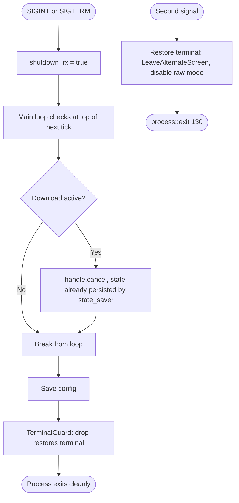
```mermaid
flowchart TD
    Signal([SIGINT or SIGTERM]) --> SetFlag[shutdown_rx = true]
    SetFlag --> LoopChecks[Main loop checks at top of next tick]
    LoopChecks --> DLActive{Download active?}
    DLActive -->|Yes| CancelDL[handle.cancel, state already persisted by state_saver]
    DLActive -->|No| Break
    CancelDL --> Break[Break from loop]
    Break --> SaveConfig[Save config]
    SaveConfig --> DropGuard[TerminalGuard::drop restores terminal]
    DropGuard --> Exit([Process exits cleanly])

    Second([Second signal]) --> Restore[Restore terminal: LeaveAlternateScreen, disable raw mode]
    Restore --> ForceExit([process::exit 130])
```

---

## 18. Error Recovery

| Scenario | Behavior |
|----------|----------|
| Network timeout during download | `irmin` retries 5x. All fail: `Error` event sent, state file preserved. |
| Panic in any code | Panic hook restores terminal before printing backtrace. |
| Early return with `?` in TUI | `TerminalGuard::drop` restores terminal. |
| Disk full during download | Write fails, `Error` event sent, state file has progress to last successful chunk. Save-failure warning logs once per streak. |
| Corrupt `config.json` | Renamed to `config.json.corrupted-{timestamp}`, fresh default created. |
| Game process crash | Exit code shown in log, `game_running` cleared on sentinel. |
| Uninstall fails (permissions) | Error modal shown with OS error. |
| VO download fails | Error modal shown, config retains the new selection (optimistic). |
| Component hash mismatch | Archive deleted, error reported. Retryable. |
| Component extraction fails | Destination dir and archive both cleaned up. |
| Log file creation fails | Logging disabled (tracing macros become no-ops). TUI unaffected. |

---

## 19. Progress Reporting

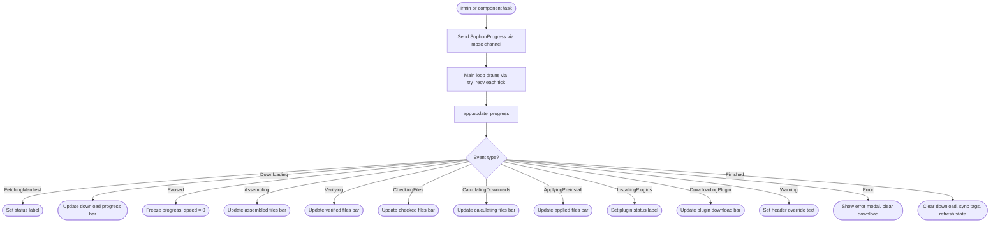
```mermaid
flowchart TD
    Source([irmin or component task]) --> ProgressTX[Send SophonProgress via mpsc channel]
    ProgressTX --> MainLoop[Main loop drains via try_recv each tick]
    MainLoop --> UpdateApp[app.update_progress]
    UpdateApp --> WhichEvent{Event type?}
    WhichEvent -->|FetchingManifest| Label([Set status label])
    WhichEvent -->|Downloading| DLBar([Update download progress bar])
    WhichEvent -->|Paused| Freeze([Freeze progress, speed = 0])
    WhichEvent -->|Assembling| AssembleBar([Update assembled files bar])
    WhichEvent -->|Verifying| VerifyBar([Update verified files bar])
    WhichEvent -->|CheckingFiles| CheckBar([Update checked files bar])
    WhichEvent -->|CalculatingDownloads| CalcBar([Update calculating files bar])
    WhichEvent -->|ApplyingPreinstall| ApplyBar([Update applied files bar])
    WhichEvent -->|InstallingPlugins| PluginLabel([Set plugin status label])
    WhichEvent -->|DownloadingPlugin| PluginBar([Update plugin download bar])
    WhichEvent -->|Warning| OverrideHeader([Set header override text])
    WhichEvent -->|Error| ShowError([Show error modal, clear download])
    WhichEvent -->|Finished| FinishEvent([Clear download, sync tags, refresh state])
```

The loop discards stale progress events where `downloaded_bytes` decreases for the same `total_bytes`.

---

## 20. Config Persistence

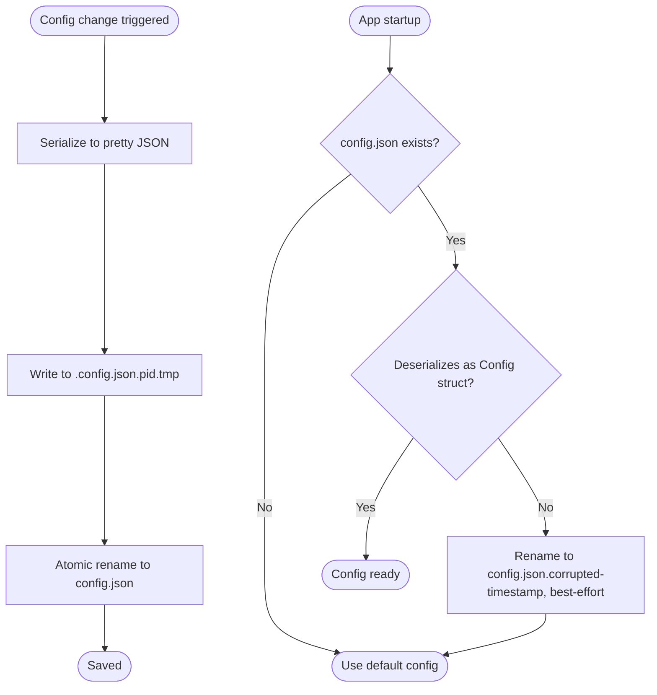
```mermaid
flowchart TD
    Change([Config change triggered]) --> Serialize[Serialize to pretty JSON]
    Serialize --> WriteTmp[Write to .config.json.pid.tmp]
    WriteTmp --> Rename[Atomic rename to config.json]
    Rename --> Done([Saved])

    Load([App startup]) --> ReadFile{config.json exists?}
    ReadFile -->|No| Default([Use default config])
    ReadFile -->|Yes| Parse{Deserializes as Config struct?}
    Parse -->|Yes| Ready([Config ready])
    Parse -->|No| Preserve[Rename to config.json.corrupted-timestamp, best-effort]
    Preserve --> Default
```

Deserialization accepts both old `vo_lang: String` and current `vo_langs: Vec<String>` formats. Old single-string configs migrate on load.

---

## 21. First Launch vs Normal Launch

```mermaid
flowchart TD
    Start([App starts]) --> HasConfig{Config file exists with install paths?}
    HasConfig -->|No| CreateDefault[Create default config]
    CreateDefault --> AllNotInstalled[All games show Get Game]
    AllNotInstalled --> NoBG[No background images cached yet]
    NoBG --> UserPicksGame[User picks game, presses Enter]
    UserPicksGame --> AssignPath[Default install path auto-assigned]
    AssignPath --> DownloadComp[Download Proton]
    DownloadComp --> DownloadGame[Download game]
    DownloadGame --> Ready([Game installed, shows Launch])

    HasConfig -->|Yes| LoadExisting[Load config with paths and versions]
    LoadExisting --> ShowState[Show per-game state: Launch or Update]
    ShowState --> CacheHit[Backgrounds from quadrant cache]
    CacheHit --> BGUpdateCheck[Background: check for updates]
    BGUpdateCheck --> Interactive([User interacts immediately])
```
